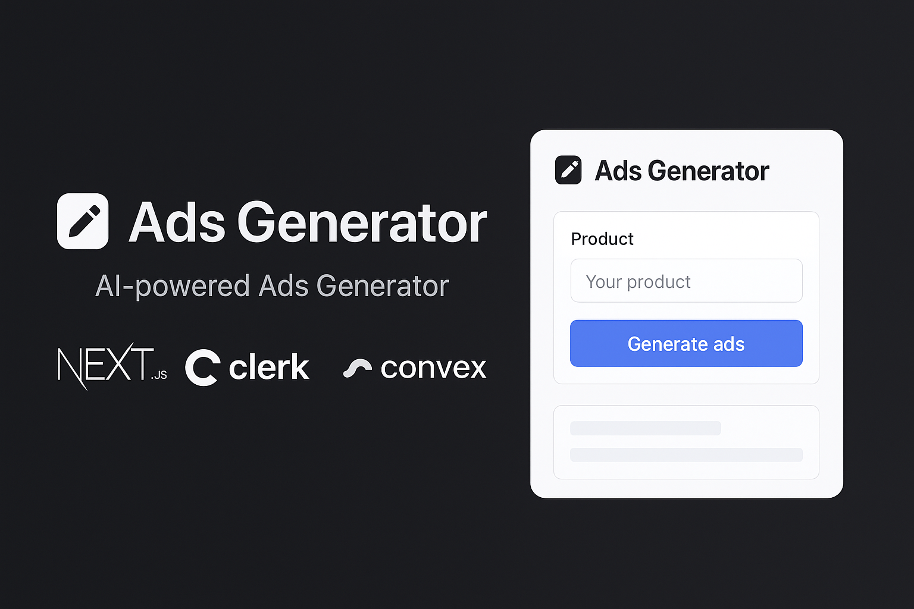

# 🚀 Ads Generator App  

<p align="center">  
    
</p>  

> ✨ An AI-powered Ads Generator built with **Next.js, Clerk, Convex, Shadcn UI, Tailwind CSS, and TypeScript** to create high-converting ad copies in seconds.  

---

## 🌟 Features  

- 🔑 **Authentication** – Secure sign-in/sign-up powered by [Clerk](https://clerk.dev/)  
- ⚡ **Realtime Backend** – Powered by [Convex](https://convex.dev/)  
- 🎨 **Beautiful UI** – Built with [Shadcn UI](https://ui.shadcn.com/) + [Tailwind CSS](https://tailwindcss.com/)  
- 🛠 **Modern Tech Stack** – Fully typed with [TypeScript](https://www.typescriptlang.org/)  
- 🤖 **AI-Powered** – Generate ad copies instantly  

---

<!-- ## 🖼️ Demo  

🔗 **Live Demo:** [ads-generator-demo.vercel.app](https://ads-generator-demo.vercel.app)   

<p align="center">  
    
</p>  

--- -->

## ⚙️ Tech Stack  

- [Next.js 14](https://nextjs.org/) – React framework for server-side rendering and routing  
- [Clerk](https://clerk.dev/) – Authentication and user management  
- [Convex](https://convex.dev/) – Realtime backend & database  
- [Shadcn UI](https://ui.shadcn.com/) – Accessible UI components  
- [Tailwind CSS](https://tailwindcss.com/) – Utility-first CSS framework  
- [TypeScript](https://www.typescriptlang.org/) – Strongly typed JavaScript  

---


## 🔑 Environment Variables  

You need to configure environment variables for **Clerk** and **Convex**.  
Create a `.env.local` file in the root of your project and add the following:  

```env
# Clerk Configuration
NEXT_PUBLIC_CLERK_FRONTEND_API=your_clerk_frontend_api_key
CLERK_API_KEY=your_clerk_backend_api_key
CLERK_JWT_KEY=your_clerk_jwt_verification_key

# Convex Configuration
NEXT_PUBLIC_CONVEX_URL=your_convex_deployment_url
CONVEX_DEPLOY_KEY=your_convex_deploy_key

# (Optional) OpenAI / AI API Key (if you use AI text generation)
OPENAI_API_KEY=your_openai_api_key

```

## 📦 Installation  

Clone the repository and install dependencies:  

```bash
git clone https://github.com/vikasthakur897/ads-generator.git
cd ads-generator
npm install
